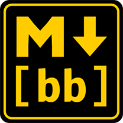

# Markdown to BBCode

Convert Markdown text to BBCode in a fast and simple way.

Allows you to customize the output of your Markdown text to multiple forums, simplifying the process of writing the same text across different sites.

You can test this online right away [here](rtxa.github.io/mdtobb).

## Features

- Allows you to use **Markdown**: a lightweight markup language useful to write texts, papers in a simple and readable way. You will focus more in the content of your text than in how is gonna look. You can learn it right [here](https://www.markdownguide.org/basic-syntax/.).
- Write your text once and output the same in different forums with almost no modifications.
- Comes already with various config styles for the most popular forum systems (vBulletin, phpBB, myBB).
- You can import your own styles configs and save them in your computer for latter use.
- Works offline. Basically you can save the page and open it without downloading anything extra.

## How to use it

1. Choose a style (vBulletin, phpBB, etc.).
2. Type some Markdown text in the top text area.
3. Results are displayed in the bottom text area.

Now you are ready to copy it and paste it into your favourite forum.

## Contribute

Feel free to create any issues or pull requests, any feedback will be appreciated.

## Thank to

- [Marked](https://marked.js.org/) - Very nice library to convert Markdown to HTML and very customizable.
- [MrHudson](https://codepen.io/MrHuds0n/pen/bgWdqe) - I liked the minimalist design of his converter and how it goes straight to the point.
